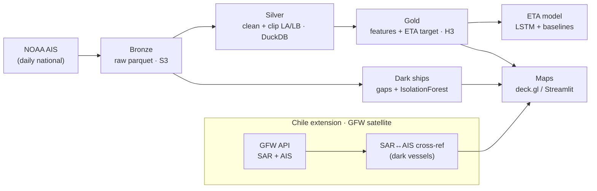
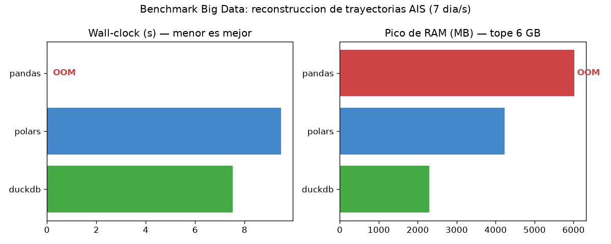
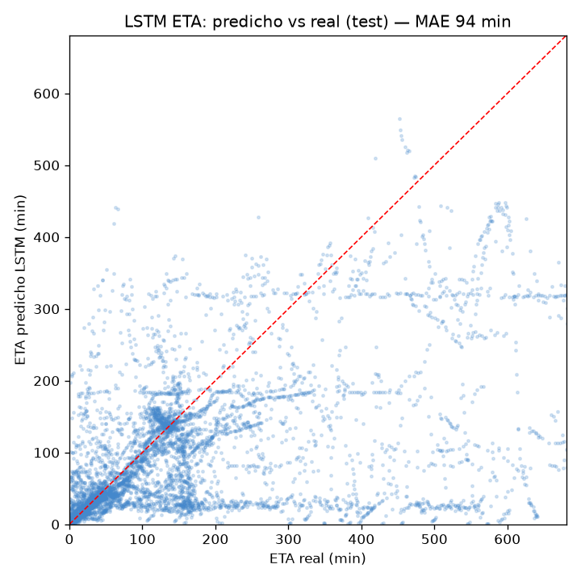
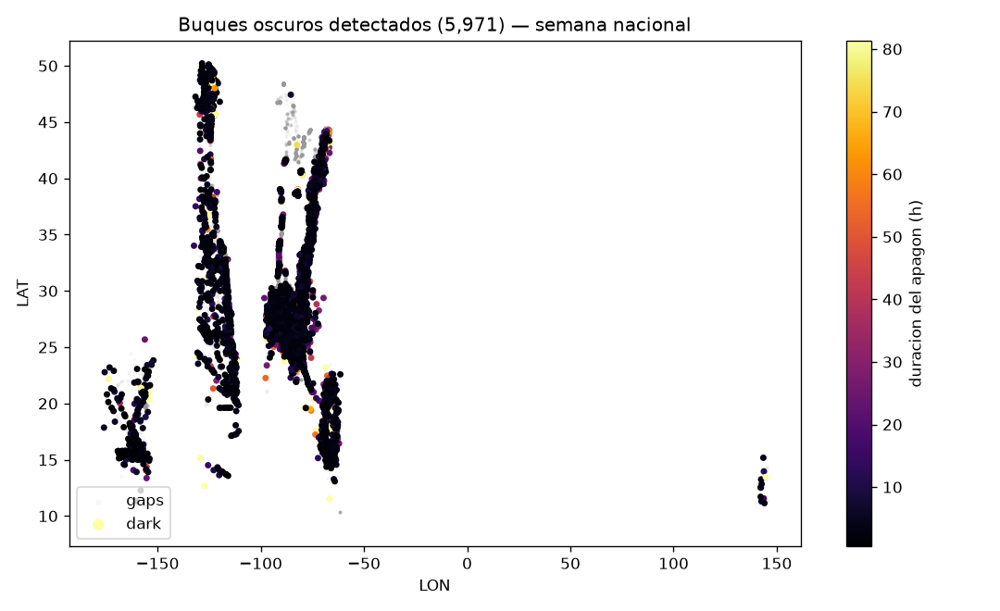

# 🚢 NaviCast-CL

> End-to-end geospatial **AIS data pipeline** — ingest → clean → features → ETA model →
> dark-ship detection → interactive maps — built on a **medallion architecture on AWS S3**,
> fully reproducible from frozen snapshots.

[](https://navicast-cl.streamlit.app/)
[](https://github.com/hungerforcoffe/navicast-cl/actions/workflows/ci.yml)
[](LICENSE)


**▶️ Live demo: https://navicast-cl.streamlit.app/**


## What I built & why

A complete data-engineering pipeline over real **AIS** (vessel tracking) data: it ingests
raw national feeds, cleans and reconstructs vessel trajectories out-of-core, engineers
geospatial features, trains an **LSTM** to predict **ETA to port**, and flags **"dark
ships"** (suspicious AIS transponder blackouts). Everything reads **frozen, versioned
snapshots from S3**, so results are reproducible — never a live API inside the pipeline.

**Honest scope:** this is a Big-Data **course project** on *reference* data (NOAA, US
waters) at **laptop scale**. The value on display is the **engineering decisions made and
justified** end-to-end — not production maritime intelligence.

## Results at a glance

| | |
|---|---|
| **50.3 M** AIS rows processed | pandas **runs out of memory** at a 6 GB budget while **DuckDB** does the same job in **2.3 GB** |
| **ETA → port (LSTM):** 94 min MAE | on **unseen vessels** (leak-free split); **1.45×** better than a physics baseline |
| **Dark-ship detector:** 74% recall | on injected blackouts; a **SAR↔AIS cross-reference** flags vessels radar sees but AIS doesn't |

## Architecture



Left = compute (laptop) · right = S3 layers. Each stage is a module with a `run()`; an
Airflow DAG only *invokes* them (with a `make`/script fallback so a broken DAG never
blocks the demo).

## The headline: out-of-core benchmark (pandas vs Polars vs DuckDB)

Same heavy operation (trajectory reconstruction: sort by vessel + time, haversine between
consecutive pings) across three engines, measuring **wall-clock and peak RAM** (each in an
isolated subprocess). At one-week scale (50 M rows) under a 6 GB budget, **pandas OOMs**
while the out-of-core engines stay flat.

| Scenario | Engine | Wall-clock (s) | Peak RAM (MB) |
|---|---|---:|---:|
| 1 day (7.3 M) | pandas | 4.24 | 1416 |
| 1 day (7.3 M) | Polars | 1.63 | 786 |
| 1 day (7.3 M) | **DuckDB** | **1.36** | **408** |
| 1 week (50 M, 6 GB cap) | pandas | **OOM** | >6000 |
| 1 week (50 M, 6 GB cap) | Polars | 9.5 | 4200 |
| 1 week (50 M, 6 GB cap) | **DuckDB** | **7.5** | **2293** |



## ETA to port — LSTM vs baselines

Sequence of recent pings per vessel → minutes until it docks. Trained on **111,727**
labeled samples (966 vessels at LA/Long Beach); evaluated on a **by-vessel split** (test =
vessels never seen in training, so no leakage).

| Model | MAE (min) |
|---|---:|
| Naive physics (dist / speed) | 136.4 |
| HistGradientBoosting | 96.0 |
| **LSTM** | **93.9** |



**Honest limitation:** the horizontal bands are vessels *anchored waiting for a berth* —
their queue time isn't in the kinematics, so no model can predict it from position/speed
alone. Diagnosed, not hidden (see `docs/eta_model_report.md`).

## Dark ships — two modalities

1. **AIS blackouts** (US national): a vessel that *was* transmitting goes silent. Detected
   with deterministic gap rules + **IsolationForest** (not an LSTM — different problem).
   5,971 flagged events; 74% recall on synthetic injected blackouts.
2. **SAR ↔ AIS cross-reference** (Chile, satellite): since terrestrial AIS barely covers
   Chile, the [GFW](https://globalfishingwatch.org) API provides **Sentinel-1 SAR**
   detections + AIS presence. A radar detection with **no AIS nearby** = a dark candidate.



## Tech stack

`DuckDB` · `Polars` · `pandas` · `PyArrow` · `geopandas` + `H3` · `PyTorch` (LSTM) ·
`scikit-learn` (IsolationForest) · `pydeck`/deck.gl + `Streamlit` · `boto3` + AWS S3 ·
`Airflow`. Python 3.14.

## Key engineering decisions (the *why*)

- **DuckDB/Polars out-of-core** over pandas — the benchmark is the proof, not a claim.
- **Reproducibility by frozen snapshots** + S3 Versioning — the pipeline reads an immutable
  snapshot ID; no live API calls. (Versioning literally saved the data after a bad overwrite.)
- **IsolationForest, not LSTM, for dark ships** — anomaly detection on irregular streams ≠
  sequence regression. The LSTM is reserved for ETA.
- **By-vessel split** for the ETA model — prevents the model from memorizing a vessel.
- **Decoupled stages** (`run()` per module) + Airflow DAG + `make`/script fallback.

## Run it

```bash
python -m venv .venv && . .venv/Scripts/activate    # Windows; use bin/ on Linux/Mac
pip install -e ".[bigdata,geo,ml,detect,app]"
pip install torch --index-url https://download.pytorch.org/whl/cpu   # CPU wheel
# full pipeline (Bronze→Silver→Gold→ETA→dark→maps); --skip-ingest reuses local Bronze
python scripts/run_pipeline.py
```

The public dashboard is self-contained: `streamlit run app/streamlit_app.py` reads the slim
snapshot in `app/data/` (no AWS needed). Details & sprint log in
[`docs/sprints.md`](docs/sprints.md); project constitution in [`CLAUDE.md`](CLAUDE.md).

## Data & attribution

- **NOAA Marine Cadastre** — US AIS (public reference data).
- **Global Fishing Watch** (Chile extension) — SAR + AIS via API, **CC BY-NC 4.0**
  (non-commercial); fishing activity is *"apparent"*. © Global Fishing Watch.

## License

Code: **MIT** (see [`LICENSE`](LICENSE)). GFW-derived data: CC BY-NC 4.0.
